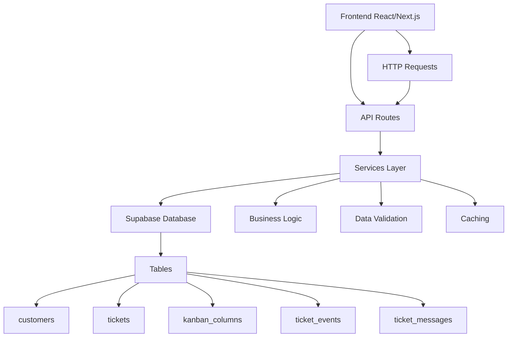
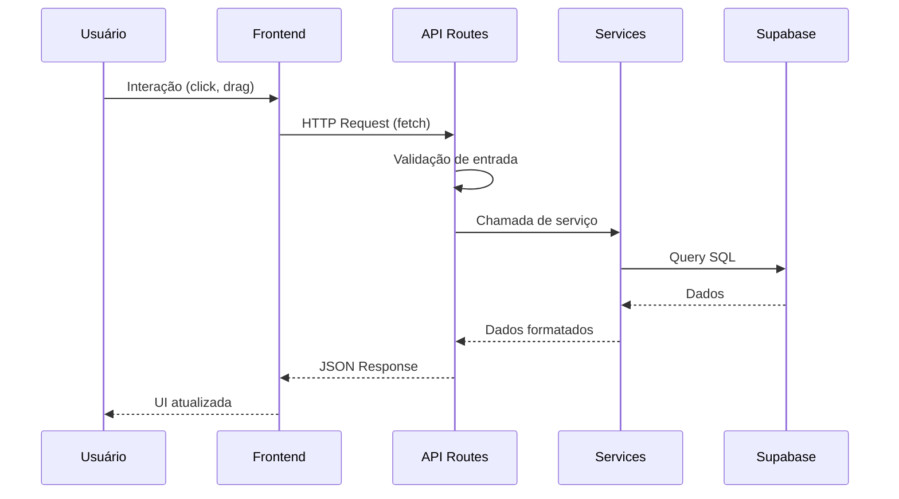

# CRM Supabase

Um sistema completo de CRM (Customer Relationship Management) com interface Kanban para gerenciamento de tickets e clientes, desenvolvido com Next.js, TypeScript e Supabase.

## 📋 Visão Geral

Este projeto implementa uma solução CRM moderna com foco em usabilidade e performance. A arquitetura segue princípios de separação de responsabilidades, garantindo segurança e escalabilidade. O sistema permite gerenciar clientes, criar e acompanhar tickets através de um quadro Kanban interativo com drag and drop.

## ✨ Funcionalidades Principais

### 🏗️ Interface Kanban
- **Quadro visual** com colunas configuráveis
- **Drag and drop** intuitivo para mover tickets entre colunas
- **Reordenação** de tickets dentro das colunas
- **Mapeamento automático** de status baseado no nome da coluna
- **Atualização em tempo real** do status dos tickets

### 👥 Gerenciamento de Clientes
- **CRUD completo** (Criar, Ler, Atualizar, Deletar)
- **Interface tabular** com filtros e busca
- **Validação de dados** com feedback visual
- **Informações completas**: nome, email, telefone, data de criação

### 🎫 Sistema de Tickets
- **Criação e edição** de tickets com detalhes completos
- **Associação com clientes** existentes
- **Sistema de prioridade** (baixa, média, alta, urgente)
- **Histórico de eventos** e mensagens
- **Filtros por status** (aberto, em andamento, aguardando cliente)
- **Modal de detalhes** com todas as informações

### 🔒 Segurança e Performance
- **Validação em camadas** (frontend e backend)
- **Rate limiting** nas APIs
- **Cache inteligente** com Next.js
- **Tratamento de erros** padronizado
- **Separação de responsabilidades** entre camadas

## 🛠️ Tecnologias Utilizadas

### Frontend
- **Next.js 16** - Framework React com App Router
- **React 19** - Biblioteca para interfaces
- **TypeScript** - Tipagem estática
- **Tailwind CSS** - Framework CSS utilitário
- **@dnd-kit** - Biblioteca para drag and drop

### Backend
- **Next.js API Routes** - APIs RESTful
- **Zod** - Validação de esquemas
- **Supabase** - Banco de dados e autenticação

### Desenvolvimento
- **ESLint** - Linting de código
- **Prettier** - Formatação automática
- **pnpm** - Gerenciador de pacotes

## 🚀 Instalação e Configuração

### Pré-requisitos
- **Node.js** 18+ ou **Bun**
- **pnpm** (recomendado) ou npm/yarn
- Conta no **Supabase**

### Passos de Instalação

1. **Clone o repositório**
   ```bash
   git clone <url-do-repositorio>
   cd crm-supabase
   ```

2. **Instale as dependências**
   ```bash
   pnpm install
   # ou
   npm install
   # ou
   bun install
   ```

3. **Configure o Supabase**
   - Crie um novo projeto no [Supabase](https://supabase.com)
   - Execute as migrações do banco:
     ```bash
     npx supabase db push
     ```
   - Copie o arquivo `.env.example` para `.env.local`
   - Preencha as variáveis de ambiente:
     ```
     NEXT_PUBLIC_SUPABASE_URL=your_supabase_url
     NEXT_PUBLIC_SUPABASE_ANON_KEY=your_supabase_anon_key
     SUPABASE_SERVICE_ROLE_KEY=your_service_role_key
     ```

4. **Execute o projeto**
   ```bash
   pnpm dev
   # ou
   npm run dev
   # ou
   bun dev
   ```

5. **Acesse a aplicação**
   - Abra [http://localhost:3000](http://localhost:3000)
   - Navegue pelas páginas: `/kanban`, `/customers`, `/tickets`

## 📁 Estrutura do Projeto

```
crm-supabase/
├── app/                          # Next.js App Router
│   ├── api/                      # APIs REST
│   │   ├── customers/           # CRUD de clientes
│   │   ├── kanban-columns/      # Gerenciamento de colunas
│   │   └── tickets/             # CRUD de tickets
│   ├── customers/               # Página de clientes
│   ├── kanban/                  # Página Kanban
│   │   └── components/          # Componentes específicos
│   ├── services/                # Camada de serviços
│   └── tickets/                 # Página de tickets
├── lib/                         # Utilitários
│   ├── api-utils.ts            # Helpers para APIs
│   ├── auth.ts                 # Autenticação
│   ├── supabase.ts             # Cliente Supabase
│   └── validations.ts          # Esquemas Zod
├── database.types.ts           # Tipos do banco
├── supabase/                   # Configurações Supabase
│   └── migrations/             # Migrações do banco
└── public/                     # Assets estáticos
```

## 🏛️ Arquitetura

### Diagrama de Camadas



### Fluxo de Dados



## 🔌 APIs Disponíveis

### Clientes (`/api/customers`)
- `GET /api/customers` - Lista todos os clientes
- `POST /api/customers` - Cria novo cliente
- `GET /api/customers/[id]` - Busca cliente por ID
- `PUT /api/customers/[id]` - Atualiza cliente
- `DELETE /api/customers/[id]` - Remove cliente

### Tickets (`/api/tickets`)
- `GET /api/tickets` - Lista tickets com relações
- `POST /api/tickets` - Cria novo ticket
- `GET /api/tickets/[id]` - Busca ticket específico
- `PATCH /api/tickets/[id]` - Atualiza ticket
- `DELETE /api/tickets/[id]` - Remove ticket
- `GET /api/tickets/open` - Lista tickets abertos

### Colunas Kanban (`/api/kanban-columns`)
- `GET /api/kanban-columns` - Lista todas as colunas

## 🗄️ Esquema do Banco de Dados

### Tabelas Principais

#### `customers`
```sql
CREATE TABLE customers (
  id UUID PRIMARY KEY DEFAULT gen_random_uuid(),
  name TEXT NOT NULL,
  email TEXT,
  phone TEXT,
  created_at TIMESTAMP DEFAULT NOW(),
  updated_at TIMESTAMP DEFAULT NOW()
);
```

#### `tickets`
```sql
CREATE TABLE tickets (
  id UUID PRIMARY KEY DEFAULT gen_random_uuid(),
  title TEXT NOT NULL,
  description TEXT,
  status status_enum DEFAULT 'open',
  priority priority_enum DEFAULT 'medium',
  customer_id UUID REFERENCES customers(id),
  kanban_column_id UUID REFERENCES kanban_columns(id),
  assigned_to TEXT,
  order_in_column INTEGER DEFAULT 0,
  created_at TIMESTAMP DEFAULT NOW(),
  updated_at TIMESTAMP DEFAULT NOW()
);
```

#### `kanban_columns`
```sql
CREATE TABLE kanban_columns (
  id UUID PRIMARY KEY DEFAULT gen_random_uuid(),
  name TEXT NOT NULL,
  position INTEGER NOT NULL,
  created_at TIMESTAMP DEFAULT NOW()
);
```

#### `ticket_events`
```sql
CREATE TABLE ticket_events (
  id UUID PRIMARY KEY DEFAULT gen_random_uuid(),
  ticket_id UUID REFERENCES tickets(id) ON DELETE CASCADE,
  event_type TEXT NOT NULL,
  description TEXT,
  created_by TEXT,
  created_at TIMESTAMP DEFAULT NOW()
);
```

#### `ticket_messages`
```sql
CREATE TABLE ticket_messages (
  id UUID PRIMARY KEY DEFAULT gen_random_uuid(),
  ticket_id UUID REFERENCES tickets(id) ON DELETE CASCADE,
  message TEXT NOT NULL,
  created_by TEXT,
  is_internal BOOLEAN DEFAULT FALSE,
  created_at TIMESTAMP DEFAULT NOW()
);
```

### Enums
- `status`: `open`, `in_progress`, `waiting_customer`, `resolved`, `closed`
- `priority`: `low`, `medium`, `high`, `urgent`

## 🧪 Desenvolvimento

### Scripts Disponíveis
```bash
pnpm dev          # Inicia servidor de desenvolvimento
pnpm build        # Build para produção
pnpm start        # Inicia servidor de produção
pnpm lint         # Executa ESLint
pnpm format       # Formata código com Prettier
```

### Convenções do Projeto
- **Idioma**: Código em inglês, documentação em português brasileiro
- **Tipagem**: TypeScript obrigatório em todos os arquivos
- **Estilo**: Tailwind CSS para componentes
- **Estado**: Gerenciamento local com React hooks
- **APIs**: Padrão RESTful com respostas padronizadas

### Diretrizes de Segurança
1. Frontend nunca acessa Supabase diretamente
2. Todas as operações passam pelas APIs Next.js
3. Validação de entrada em múltiplas camadas
4. Tratamento de erros sem exposição de detalhes internos
5. Rate limiting nas rotas públicas

## 🤝 Contribuição

1. Fork o projeto
2. Crie uma branch para sua feature (`git checkout -b feature/nova-funcionalidade`)
3. Commit suas mudanças (`git commit -am 'Adiciona nova funcionalidade'`)
4. Push para a branch (`git push origin feature/nova-funcionalidade`)
5. Abra um Pull Request

### Padrões de Código
- Siga as configurações do ESLint e Prettier
- Mantenha a arquitetura em camadas
- Adicione testes para novas funcionalidades
- Documente mudanças significativas

## 📄 Licença

Este projeto está sob a licença MIT. Veja o arquivo `LICENSE` para mais detalhes.

## 📞 Suporte

Para dúvidas ou sugestões, abra uma issue no repositório ou entre em contato com a equipe de desenvolvimento.
